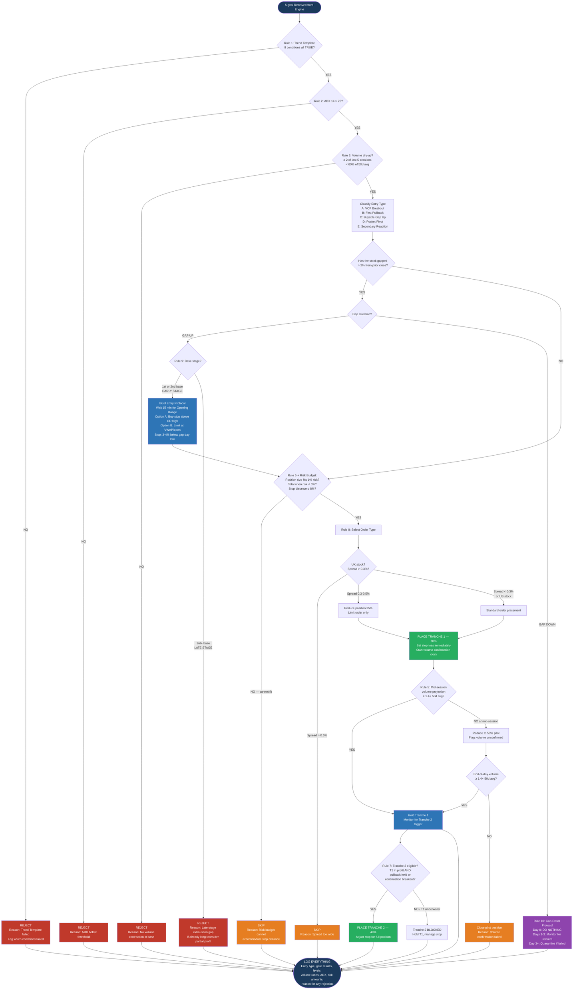

# MONEY PROGRAM — THE TRADING PROGRAM

## Entry Refinement Masterclass

**Precision Entry Rules for Swing Trading — US & UK Equities**

Version 1.0 | March 2026

*Process Over Prediction | Discipline Over Activity | Compounding Over Excitement*

---

## 1. Purpose & Philosophy

This document defines the precision entry rules for the Money Program Trading Program. Our signal engine identifies high-probability swing trade setups in US and UK equities, but the entry ranges can be wide. This refinement layer narrows the *when* and *how* of execution, turning good signals into great entries.

The rules draw from the collected wisdom of the traders already embedded in our methodology — Livermore, O'Neil, Minervini, Darvas, and Raschke — plus supplementary techniques from Morales, Gil, and institutional volume analysis.

### 1.1 Core Principle

**Buy at the moment of least risk.** Every rule below serves one purpose: to enter as close as possible to the point where the trade is proven wrong, minimising the distance between entry and stop.

### 1.2 Design for Automation

This refinement layer is designed to run hands-off. Every rule is expressed as a boolean condition or numerical threshold. There are no subjective judgements. The AI evaluates, decides, and executes — or rejects — without human intervention. The only human touchpoint is the weekly review of the audit log.

---

## 2. Entry Type Taxonomy

Not all entries are equal. The signal engine classifies each opportunity into one of five entry types, each with its own execution playbook.

| Type | Name | Key Trigger |
|------|------|-------------|
| A | VCP Breakout | Price closes above pivot on volume ≥ 40% above 50-day average |
| B | First Pullback to EMA | First touch of the 10 or 20 EMA after a clean breakout or gap |
| C | Buyable Gap Up (BGU) | Gap up from a proper base on earnings or catalyst, volume ≥ 2× average |
| D | Pocket Pivot | Up-day volume exceeds highest down-day volume of prior 10 sessions |
| E | Secondary Reaction Re-Entry | Livermore-style pullback to a prior pivotal point that holds on declining volume |

---

## 3. The Master Entry Rules

These 12 rules form the refinement layer. Every trade must satisfy the applicable subset before execution. Rules are grouped by phase: Pre-Entry Qualification, Execution Mechanics, and Gap-Specific Handling.

### 3.1 Pre-Entry Qualification

#### Rule 1: Trend Template Confirmation (Minervini)

Before any entry is considered, the stock must pass **all eight** criteria of Minervini's Trend Template:

| # | Condition | Automated Check |
|---|-----------|-----------------|
| 1 | Price > 150-day MA | `close > MA(150)` |
| 2 | Price > 200-day MA | `close > MA(200)` |
| 3 | 150-day MA > 200-day MA | `MA(150) > MA(200)` |
| 4 | 200-day MA trending up for ≥ 1 month | `MA(200) today > MA(200) 22 trading days ago` |
| 5 | 50-day MA > 150-day MA | `MA(50) > MA(150)` |
| 6 | 50-day MA > 200-day MA | `MA(50) > MA(200)` |
| 7 | Price > 50-day MA | `close > MA(50)` |
| 8 | Price ≥ 25% above 52-week low | `close >= (52wk_low × 1.25)` |
| 9 | Price within 25% of 52-week high | `close >= (52wk_high × 0.75)` |
| 10 | RS Rating ≥ 70 | `rs_percentile >= 70` |

**Automation:** If any single condition returns `FALSE`, the signal is suppressed. No override. No exceptions.

#### Rule 2: ADX Trend Strength Filter (Raschke)

| Parameter | Threshold |
|-----------|-----------|
| ADX period | 14 |
| Minimum at signal generation | > 25 |
| Invalidation | ADX falls below 25 during pullback/consolidation after being > 30 |

**Automation:** `ADX(14) > 25` must be `TRUE` at the moment of order placement. If `FALSE`, gate closes.

#### Rule 3: Volume Dry-Up in the Base (O'Neil / Minervini)

During the consolidation or pullback phase preceding the entry, volume must contract significantly. This is the footprint of institutional holders sitting tight — supply has dried up, and the stock is coiled for a move.

| Parameter | Threshold |
|-----------|-----------|
| Lookback window | Last 5 sessions before trigger |
| Required dry-up sessions | ≥ 2 of 5 |
| Dry-up definition | Volume ≤ 60% of 50-day average volume |

**Automation:**

```
dry_sessions = count(volume[i] < avg_volume_50d * 0.60 for i in last_5_sessions)
PASS if dry_sessions >= 2
```

---

### 3.2 Execution Mechanics

#### Rule 4: The Pivot Buy Point (Minervini / O'Neil)

The pivot buy point is the highest price in the last, tightest contraction of the VCP or base pattern.

| Parameter | Value |
|-----------|-------|
| Trigger | Price trades 1 tick above pivot (1 penny / 1 pence) |
| Order type | Buy-stop limit |
| Stop price | Pivot + 1–2% |
| Limit price | Pivot + 5% (maximum chase) |
| Chase rule | If open > pivot + 3% without gap classification → SKIP, wait for pullback |

**Automation:**

```
IF open > pivot * 1.03 AND gap_classified == FALSE:
    action = SKIP
    reason = "Opened too far above pivot without qualifying gap"
ELSE:
    place_buy_stop_limit(stop=pivot * 1.01, limit=pivot * 1.05)
```

#### Rule 5: Volume Confirmation on the Breakout

The breakout session must show volume conviction.

| Parameter | Threshold |
|-----------|-----------|
| Required breakout volume | ≥ 1.4× the 50-day average |
| Mid-session check (US) | 11:30 AM ET |
| Mid-session check (UK) | 12:15 PM GMT |
| Mid-session projected volume < threshold | Reduce to 50% pilot position |
| End-of-day volume < threshold | Close the pilot; entry failed |

**Automation:**

```
projected_volume = (current_volume / elapsed_minutes) * total_session_minutes

IF time == mid_session AND projected_volume < avg_volume_50d * 1.40:
    reduce_position(0.50)
    flag = "PILOT — volume unconfirmed"

IF time == close AND actual_volume < avg_volume_50d * 1.40:
    close_position()
    reason = "Volume confirmation failed"
```

#### Rule 6: The First Pullback Entry (Raschke / Livermore)

When a breakout has already occurred and we missed the pivot, the first pullback to the 10-day or 20-day EMA becomes the secondary entry.

| Condition | Requirement |
|-----------|-------------|
| Touch number | Must be the **first** touch of 10 or 20 EMA since breakout |
| Volume during pullback | Declining (each session's volume < prior session's) |
| ADX | Still > 25 |
| Entry trigger | Buy-stop above the high of the first candle that touches the EMA |
| Stop-loss | Below the swing low of the pullback |

**Automation:**

```
IF ema_touch_count_since_breakout == 1
   AND volume_declining_during_pullback == TRUE
   AND ADX(14) > 25:
    place_buy_stop(price=high_of_touch_candle + 0.01)
    set_stop(swing_low_of_pullback - 0.01)
```

#### Rule 7: Scaling Protocol

Rather than committing the full position at once, use a two-tranche approach:

| Tranche | Size | Trigger | Condition |
|---------|------|---------|-----------|
| 1 | 60% of calculated position | Primary entry (pivot, pullback, or gap rule) | Always placed if gates pass |
| 2 | 40% of calculated position | Follow-through confirmation | **Only if Tranche 1 is in profit** |

Tranche 2 triggers:

- First pullback to 10 EMA that holds (if Tranche 1 was a breakout entry), OR
- Continuation breakout above first session's high

**Never average down. If Tranche 1 is underwater, there is no Tranche 2.**

**Automation:**

```
IF tranche_1_unrealised_pnl > 0
   AND (first_pullback_held OR continuation_breakout):
    place_tranche_2(size=position_size * 0.40)
ELSE:
    tranche_2 = BLOCKED
```

#### Rule 8: Order Type Selection Matrix

| Scenario | Order Type | Parameters | Rationale |
|----------|-----------|------------|-----------|
| Standard breakout | Buy-stop limit | Stop: pivot +1–2%, Limit: pivot +5% | Entry on momentum without chasing |
| Pullback to EMA | Limit order | At EMA level | Price is coming to us |
| Buyable Gap Up | Limit on pullback OR buy-stop above OR high | See Rule 9 | Controlled gap entry |
| UK / illiquid (spread > 0.3%) | Limit order only | At or near bid | Wider spreads make market orders expensive |
| AIM stock (any entry) | Limit order only | At bid or mid | Protect against spread slippage |

---

### 3.3 Gap-Specific Entry Rules

Gaps are the primary reason wide entry ranges exist. These rules classify every gap and prescribe the precise response.

#### Rule 9: Buyable Gap Up (BGU) Protocol

A Buyable Gap Up occurs when a stock gaps above a proper base on a fundamental catalyst with strong volume.

**Classification conditions (all must be TRUE):**

| Condition | Check |
|-----------|-------|
| Gap source | Earnings, revenue guidance, sector catalyst, major contract |
| Gap size | > 2% above prior close |
| Volume | ≥ 2× the 50-day average |
| Base stage | First or second base breakout only (early-stage) |
| Late-stage (3rd+ base) | **DO NOT BUY** — likely exhaustion gap |

**Execution:**

```
WAIT 15 minutes after open → establish Opening Range (OR)

Option A — Momentum entry:
    place_buy_stop(price=opening_range_high + 0.01)
    stop = gap_day_low - (gap_day_low * 0.03)

Option B — Pullback entry:
    entry_level = MAX(gap_day_open, intraday_vwap)
    place_limit(price=entry_level)
    stop = gap_day_low - (gap_day_low * 0.03)

IF stop_distance > max_risk_budget:
    reduce_position_size to fit 1% risk rule
    IF position_size < minimum_viable_size:
        action = SKIP
        reason = "Gap too wide for risk budget"
```

#### Rule 10: Gap-Down and Failed Breakout Protocol

When a stock gaps down through a recent buy point:

```
DAY 0 (gap-down day):
    action = DO NOTHING
    reason = "No knife-catching"

DAYS 1–3:
    MONITOR for pivot reclaim
    IF close > prior_pivot AND volume > avg_volume_50d:
        RE-ENTER with stop below gap-down day low

AFTER DAY 3:
    IF pivot NOT reclaimed:
        REMOVE from active watchlist
        QUARANTINE for 10 trading days
        reason = "Failed reclaim — structural damage"
```

#### Rule 11: Overnight Gap Risk Management

These rules run continuously on all open positions, not just at entry.

| Rule | Implementation |
|------|----------------|
| Never hold through earnings | Auto-exit EOD before earnings date. No exceptions. |
| Binary catalyst protection | If catalyst date known (FDA, legal, etc.), reduce to 50% or exit by EOD prior. |
| Gap-risk position sizing | `max_shares = (portfolio × 0.01) / (entry × 0.10)` — ensures a 10% overnight gap = max 1% portfolio loss |
| Sector correlation | If ≥ 3 positions in same sector, reduce each to 75% of normal size |

---

## 4. UK-Specific Considerations (LSE)

All US rules apply to UK equities with the following adjustments.

#### Rule 12: LSE Auction, Spread, and Cost Rules

| Area | Rule | Implementation |
|------|------|----------------|
| Opening Auction (07:50–08:00 GMT) | Limit orders only into the auction | `order_type = LIMIT; price <= expected_uncrossing + 0.5%` |
| Closing Auction (16:30–16:35 GMT) | Reference closing auction price for stop evaluation | `stop_reference = auction_close_price` |
| Spread > 0.3% | Reduce position by 25% | `IF bid_ask_spread_pct > 0.30: position *= 0.75` |
| Spread > 0.5% | Skip the trade entirely | `IF bid_ask_spread_pct > 0.50: action = SKIP` |
| FTSE 100 | Standard rules apply | Spreads typically 2–5 bps |
| FTSE 250 | Check spread before every order | Spreads typically 10–30 bps |
| AIM | Limit orders only, always check depth | Spreads 20–50+ bps |
| Stamp Duty (SDRT) | Factor 0.5% into breakeven | `adjusted_breakeven = entry * 1.005` |
| CFD optimisation | For holds < 10 days, CFD may avoid SDRT | `IF expected_hold_days < 10: prefer_cfd = TRUE` |
| Volume thresholds | Use %-of-average, not absolute | Same 40–50% rule on stock's own baseline |

---

## 5. Risk Budget Integration

The entry refinement rules operate within the Trading Program's risk framework. These are hard limits — the system cannot override them.

| Parameter | Hard Limit |
|-----------|-----------|
| Maximum risk per trade | 1% of total portfolio value |
| Maximum open risk (all positions) | 6% of total portfolio value |
| Initial stop distance | Determined by entry type (breakout: 5–8%, pullback: swing-low) |
| Position size formula | `shares = (portfolio × 0.01) / (entry_price - stop_price)` |
| Maximum single position | 10% of portfolio at cost |
| Overnight gap allowance | 10% gap = max 1% portfolio loss |
| Minimum reward:risk ratio | 3:1 (based on average historical move for the setup type) |

```
BEFORE every order:

total_open_risk = SUM(risk_per_position for all open positions)
new_trade_risk  = (entry_price - stop_price) * shares

IF total_open_risk + new_trade_risk > portfolio * 0.06:
    action = SKIP
    reason = "Portfolio risk budget exhausted"

IF (entry_price - stop_price) / entry_price > 0.08:
    action = SKIP
    reason = "Stop distance exceeds 8% — risk per share too high"
```

---

## 6. Automation Flowchart

This is the complete decision logic the AI executes for every incoming signal. There are no manual steps.



### 6.1 Flowchart Legend

| Colour | Meaning |
|--------|---------|
| Dark blue | Start / End (logging) |
| Red | Hard REJECT — signal killed |
| Orange | SKIP — signal valid but execution blocked (risk, spread, volume) |
| Green | ORDER PLACED — capital committed |
| Blue | HOLD / PROCESS — in-progress evaluation |
| Purple | SPECIAL PROTOCOL — gap-down handling |

### 6.2 Continuous Background Processes

These run in parallel on all open positions, independent of the entry flowchart:

```
EVERY SESSION:
    FOR each open_position:

        // Rule 11: Earnings check
        IF earnings_date <= next_trading_day:
            CLOSE position at market
            reason = "Pre-earnings auto-exit"

        // Rule 11: Binary catalyst check
        IF binary_catalyst_date <= next_2_trading_days:
            REDUCE position to 50%
            reason = "Binary catalyst protection"

        // Rule 11: Overnight gap sizing check
        IF position_risk_at_10pct_gap > portfolio * 0.01:
            TRIM to compliant size
            reason = "Overnight gap risk exceeded"

        // Rule 12: UK spread monitoring
        IF market == LSE AND current_spread_pct > 0.50:
            FLAG for manual review
            TIGHTEN stop to breakeven if possible
```

---

## 7. Automation Specifications

### 7.1 Required Data Feeds

| Feed | Frequency | Source (US) | Source (UK) |
|------|-----------|------------|------------|
| Daily OHLCV | End of day | NYSE, NASDAQ | LSE Main, AIM |
| Intraday bars (5-min) | Real-time | Direct feed or API | Direct feed or API |
| Bid-ask spread | Real-time / 15-min delay | Level 1 quote | Level 1 quote |
| Earnings calendar | Daily sync | Provider API | Provider API |
| Catalyst calendar (FDA, legal, ex-div) | Daily sync | Provider API | Provider API |

### 7.2 Pre-Computed Indicators (Daily)

| Indicator | Parameters |
|-----------|-----------|
| Simple Moving Averages | MA(50), MA(150), MA(200) |
| Exponential Moving Averages | EMA(10), EMA(20) |
| ADX | ADX(14) |
| Average Volume | 50-day average |
| Relative Strength | Percentile rank vs. universe |
| 52-week high / low | Rolling |
| VCP pivot detection | Proprietary pattern engine |
| Base stage count | Count of bases since trend began |

### 7.3 Logic Gate Summary

Every signal passes through five sequential gates. All must return `TRUE`.

```
GATE 1: Trend Template        → 8 sub-conditions, all TRUE
GATE 2: ADX(14) > 25          → Boolean
GATE 3: Volume dry-up         → ≥ 2 of 5 sessions < 60% avg
GATE 4: Entry type + gap rules → Classification + gap protocol
GATE 5: Risk budget           → Position size, stop, total risk
─────────────────────────────────────────────────────────
OUTPUT: Order with type, size, stop, and tranche plan
        OR Rejection with reason code
```

### 7.4 Rejection Reason Codes

| Code | Reason | Action |
|------|--------|--------|
| R01 | Trend Template failed | Suppress signal |
| R02 | ADX below threshold | Suppress signal |
| R03 | No volume dry-up | Suppress signal |
| R04 | Late-stage exhaustion gap | Suppress signal |
| R05 | Risk budget exceeded | Skip, add to watchlist |
| R06 | Spread too wide (UK) | Skip, monitor for spread improvement |
| R07 | Volume confirmation failed | Close pilot position |
| R08 | Opened > 3% above pivot (no gap) | Skip, wait for pullback |
| R09 | Gap-down — awaiting reclaim | Monitor 3 days |
| R10 | Total portfolio risk at limit | Skip until risk freed |

### 7.5 Logging Schema

Every decision — entry, skip, or reject — is logged with full context.

```json
{
  "timestamp": "ISO-8601",
  "signal_id": "unique_id",
  "ticker": "AAPL",
  "market": "US" | "UK",
  "entry_type": "A" | "B" | "C" | "D" | "E",
  "decision": "ENTER" | "SKIP" | "REJECT",
  "reason_code": "R01–R10 or null",
  "gates": {
    "trend_template": true,
    "adx": 28.4,
    "volume_dryup": 3,
    "gap_classified": false,
    "risk_budget_ok": true
  },
  "levels": {
    "pivot": 145.20,
    "entry_price": 145.85,
    "stop_price": 137.20,
    "risk_per_share": 8.65,
    "position_size": 115,
    "risk_amount": 994.75,
    "portfolio_risk_pct": 0.99
  },
  "volume": {
    "breakout_volume": 2450000,
    "avg_50d_volume": 1580000,
    "volume_ratio": 1.55
  },
  "tranche": {
    "tranche_1_size": 69,
    "tranche_2_eligible": false,
    "tranche_2_size": 0
  },
  "uk_specific": {
    "spread_pct": null,
    "stamp_duty_applied": false,
    "cfd_preferred": false
  }
}
```

---

## 8. Sources & Methodology Lineage

The rules in this document are synthesised from the following practitioners and their core works:

**Mark Minervini** — SEPA methodology, Volatility Contraction Pattern (VCP), Trend Template, pivot buy points. *Think & Trade Like a Champion.*

**William O'Neil** — CAN SLIM system, proper buy points, pocket pivots, volume confirmation on breakouts. *How to Make Money in Stocks.*

**Linda Raschke** — Holy Grail setup, first-pullback-to-EMA entry, ADX trend strength filter. *Street Smarts* (with Connors).

**Nicolas Darvas** — Box theory, breakout above the box top on volume, trailing stop at box bottom. *How I Made $2,000,000 in the Stock Market.*

**Jesse Livermore** — Pivotal points, secondary reactions, volume confirmation, patience in entry timing. *How to Trade in Stocks.*

**Gil Morales** — Buyable Gap Up (BGU) rules, opening-range methodology. *Trade Like an O'Neil Disciple.*
