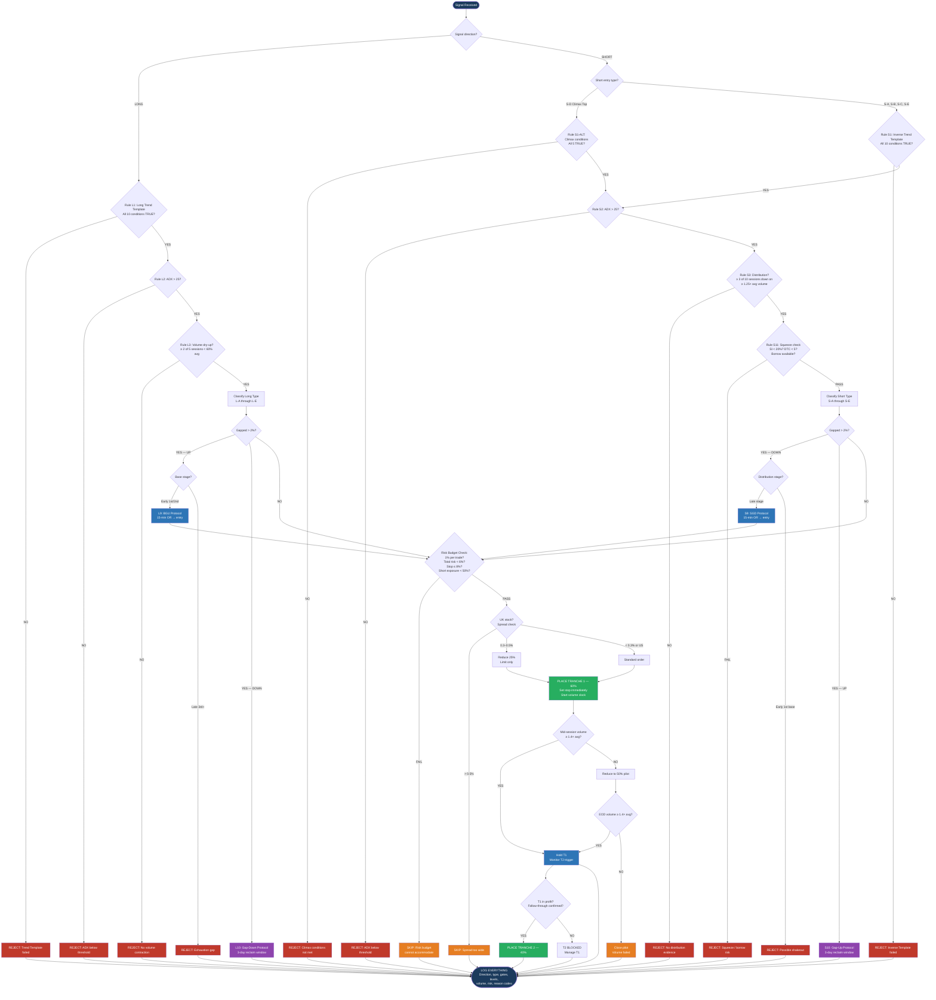

# MONEY PROGRAM — THE TRADING PROGRAM

## Entry Refinement Masterclass

**Precision Entry Rules for Swing Trading — US & UK Equities**

**Long & Short**

Version 2.0 | March 2026

*Process Over Prediction | Discipline Over Activity | Compounding Over Excitement*

---

## 1. Purpose & Philosophy

This document defines the precision entry rules for the Money Program Trading Program. Our signal engine identifies high-probability swing trade setups — both long and short — in US and UK equities, but the entry ranges can be wide. This refinement layer narrows the *when* and *how* of execution, turning good signals into great entries.

The rules draw from the collected wisdom of the traders already embedded in our methodology — Livermore, O'Neil, Minervini, Darvas, and Raschke — plus supplementary techniques from Morales, Gil, Kacher, and institutional volume analysis.

### 1.1 Core Principle

**Enter at the moment of least risk.** Every rule below serves one purpose: to enter as close as possible to the point where the trade is proven wrong, minimising the distance between entry and stop.

This applies equally to longs and shorts. On the short side, we sell at the point of maximum overhead resistance, where a move against us is immediately identifiable.

### 1.2 Design for Automation

This refinement layer is designed to run hands-off. Every rule is expressed as a boolean condition or numerical threshold. There are no subjective judgements. The AI evaluates, decides, and executes — or rejects — without human intervention. The only human touchpoint is the weekly review of the audit log.

### 1.3 Losing Trades Kill You

The entire architecture of this system is built around one truth: it is not the winning trades that determine your outcome — it is how you handle the losers. Every gate, every threshold, every position-sizing formula exists to make losses small, fast, and fully documented. If a trade does not meet every condition, it does not get entered. Period.

---

## 2. Entry Type Taxonomy

### 2.1 Long Entry Types

| Type | Name | Key Trigger |
|------|------|-------------|
| L-A | VCP Breakout | Price closes above pivot on volume ≥ 40% above 50-day average |
| L-B | First Pullback to EMA | First touch of 10 or 20 EMA after a clean breakout or gap |
| L-C | Buyable Gap Up (BGU) | Gap up from a proper base on earnings/catalyst, volume ≥ 2× average |
| L-D | Pocket Pivot | Up-day volume exceeds highest down-day volume of prior 10 sessions |
| L-E | Secondary Reaction Re-Entry | Livermore-style pullback to a prior pivotal point that holds on declining volume |

### 2.2 Short Entry Types

| Type | Name | Key Trigger |
|------|------|-------------|
| S-A | Head & Shoulders Breakdown | Price closes below neckline on volume ≥ 40% above 50-day average |
| S-B | Rally into Resistance (First Bounce to EMA) | First touch of declining 10 or 20 EMA after a clean breakdown |
| S-C | Shortable Gap Down (SGD) | Gap down from a late-stage top on earnings miss/catalyst, volume ≥ 2× average |
| S-D | Climax Top Reversal | Exhaustion move: widest daily range + highest volume in the trend, followed by reversal |
| S-E | Failed Breakout Short | Stock breaks above a pivot, fails within 3 sessions, and closes back below on volume |

---

## 3. The Master Entry Rules — LONG SIDE

These rules form the long-side refinement layer. Every long trade must satisfy the applicable subset before execution.

### 3.1 Pre-Entry Qualification

#### Rule L1: Trend Template Confirmation (Minervini)

Before any long entry is considered, the stock must pass **all** criteria:

| # | Condition | Automated Check |
|---|-----------|-----------------|
| 1 | Price > 150-day MA | `close > MA(150)` |
| 2 | Price > 200-day MA | `close > MA(200)` |
| 3 | 150-day MA > 200-day MA | `MA(150) > MA(200)` |
| 4 | 200-day MA trending up for ≥ 1 month | `MA(200) today > MA(200) 22 trading days ago` |
| 5 | 50-day MA > 150-day MA | `MA(50) > MA(150)` |
| 6 | 50-day MA > 200-day MA | `MA(50) > MA(200)` |
| 7 | Price > 50-day MA | `close > MA(50)` |
| 8 | Price ≥ 25% above 52-week low | `close >= (52wk_low × 1.25)` |
| 9 | Price within 25% of 52-week high | `close >= (52wk_high × 0.75)` |
| 10 | RS Rating ≥ 70 | `rs_percentile >= 70` |

**Automation:** If any single condition returns `FALSE`, the signal is suppressed. No override. No exceptions.

#### Rule L2: ADX Trend Strength Filter (Raschke)

| Parameter | Threshold |
|-----------|-----------|
| ADX period | 14 |
| Minimum at signal generation | > 25 |
| Invalidation | ADX falls below 25 during pullback/consolidation after being > 30 |

**Automation:** `ADX(14) > 25` must be `TRUE` at the moment of order placement. If `FALSE`, gate closes.

#### Rule L3: Volume Dry-Up in the Base (O'Neil / Minervini)

During the consolidation or pullback phase preceding the entry, volume must contract significantly.

| Parameter | Threshold |
|-----------|-----------|
| Lookback window | Last 5 sessions before trigger |
| Required dry-up sessions | ≥ 2 of 5 |
| Dry-up definition | Volume ≤ 60% of 50-day average volume |

```
dry_sessions = count(volume[i] < avg_volume_50d * 0.60 for i in last_5_sessions)
PASS if dry_sessions >= 2
```

### 3.2 Execution Mechanics

#### Rule L4: The Pivot Buy Point (Minervini / O'Neil)

| Parameter | Value |
|-----------|-------|
| Trigger | Price trades 1 tick above pivot (1 penny / 1 pence) |
| Order type | Buy-stop limit |
| Stop price | Pivot + 1–2% |
| Limit price | Pivot + 5% (maximum chase) |
| Chase rule | If open > pivot + 3% without gap classification → SKIP, wait for pullback |

```
IF open > pivot * 1.03 AND gap_classified == FALSE:
    action = SKIP
    reason = "Opened too far above pivot without qualifying gap"
ELSE:
    place_buy_stop_limit(stop=pivot * 1.01, limit=pivot * 1.05)
```

#### Rule L5: Volume Confirmation on Breakout

| Parameter | Threshold |
|-----------|-----------|
| Required breakout volume | ≥ 1.4× the 50-day average |
| Mid-session check (US) | 11:30 AM ET |
| Mid-session check (UK) | 12:15 PM GMT |
| Mid-session projected volume < threshold | Reduce to 50% pilot position |
| End-of-day volume < threshold | Close the pilot; entry failed |

```
projected_volume = (current_volume / elapsed_minutes) * total_session_minutes

IF time == mid_session AND projected_volume < avg_volume_50d * 1.40:
    reduce_position(0.50)
    flag = "PILOT — volume unconfirmed"

IF time == close AND actual_volume < avg_volume_50d * 1.40:
    close_position()
    reason = "Volume confirmation failed"
```

#### Rule L6: The First Pullback Entry (Raschke / Livermore)

| Condition | Requirement |
|-----------|-------------|
| Touch number | Must be the **first** touch of 10 or 20 EMA since breakout |
| Volume during pullback | Declining (each session's volume < prior session's) |
| ADX | Still > 25 |
| Entry trigger | Buy-stop above the high of the first candle that touches the EMA |
| Stop-loss | Below the swing low of the pullback |

```
IF ema_touch_count_since_breakout == 1
   AND volume_declining_during_pullback == TRUE
   AND ADX(14) > 25:
    place_buy_stop(price=high_of_touch_candle + 0.01)
    set_stop(swing_low_of_pullback - 0.01)
```

#### Rule L7: Scaling Protocol

| Tranche | Size | Trigger | Condition |
|---------|------|---------|-----------|
| 1 | 60% of calculated position | Primary entry (pivot, pullback, or gap rule) | Always placed if gates pass |
| 2 | 40% of calculated position | Follow-through confirmation | **Only if Tranche 1 is in profit** |

**Never average down. If Tranche 1 is underwater, there is no Tranche 2.**

```
IF tranche_1_unrealised_pnl > 0
   AND (first_pullback_held OR continuation_breakout):
    place_tranche_2(size=position_size * 0.40)
ELSE:
    tranche_2 = BLOCKED
```

#### Rule L8: Order Type Selection Matrix

| Scenario | Order Type | Parameters | Rationale |
|----------|-----------|------------|-----------|
| Standard breakout | Buy-stop limit | Stop: pivot +1–2%, Limit: pivot +5% | Entry on momentum without chasing |
| Pullback to EMA | Limit order | At EMA level | Price is coming to us |
| Buyable Gap Up | Limit on pullback OR buy-stop above OR high | See Rule L9 | Controlled gap entry |
| UK / illiquid (spread > 0.3%) | Limit order only | At or near bid | Wider spreads make market orders expensive |
| AIM stock (any entry) | Limit order only | At bid or mid | Protect against spread slippage |

### 3.3 Gap-Specific Rules (Long)

#### Rule L9: Buyable Gap Up (BGU) Protocol

**Classification conditions (all must be TRUE):**

| Condition | Check |
|-----------|-------|
| Gap source | Earnings, revenue guidance, sector catalyst, major contract |
| Gap size | > 2% above prior close |
| Volume | ≥ 2× the 50-day average |
| Base stage | First or second base breakout only (early-stage) |
| Late-stage (3rd+ base) | **DO NOT BUY** — likely exhaustion gap |

**Execution:**

```
WAIT 15 minutes after open → establish Opening Range (OR)

Option A — Momentum entry:
    place_buy_stop(price=opening_range_high + 0.01)
    stop = gap_day_low - (gap_day_low * 0.03)

Option B — Pullback entry:
    entry_level = MAX(gap_day_open, intraday_vwap)
    place_limit(price=entry_level)
    stop = gap_day_low - (gap_day_low * 0.03)

IF stop_distance > max_risk_budget:
    reduce_position_size to fit 1% risk rule
    IF position_size < minimum_viable_size:
        action = SKIP
        reason = "Gap too wide for risk budget"
```

#### Rule L10: Gap-Down and Failed Long Protocol

```
DAY 0 (gap-down day):
    action = DO NOTHING
    reason = "No knife-catching"

DAYS 1–3:
    MONITOR for pivot reclaim
    IF close > prior_pivot AND volume > avg_volume_50d:
        RE-ENTER with stop below gap-down day low

AFTER DAY 3:
    IF pivot NOT reclaimed:
        REMOVE from active watchlist
        QUARANTINE for 10 trading days
        reason = "Failed reclaim — structural damage"
```

---

## 4. The Master Entry Rules — SHORT SIDE

These rules mirror the long-side architecture but are tuned for the specific dynamics of short selling: distribution patterns, failed rallies, and the tendency of declines to be faster and more violent than advances.

### 4.1 Pre-Entry Qualification (Short)

#### Rule S1: Inverse Trend Template (Minervini Stage 4 / O'Neil)

Before any short entry is considered, the stock must pass **all** criteria of the inverse trend template — confirming a Stage 4 decline:

| # | Condition | Automated Check |
|---|-----------|-----------------|
| 1 | Price < 150-day MA | `close < MA(150)` |
| 2 | Price < 200-day MA | `close < MA(200)` |
| 3 | 150-day MA < 200-day MA | `MA(150) < MA(200)` |
| 4 | 200-day MA trending down for ≥ 1 month | `MA(200) today < MA(200) 22 trading days ago` |
| 5 | 50-day MA < 150-day MA | `MA(50) < MA(150)` |
| 6 | 50-day MA < 200-day MA | `MA(50) < MA(200)` |
| 7 | Price < 50-day MA | `close < MA(50)` |
| 8 | Price ≥ 25% below 52-week high | `close <= (52wk_high × 0.75)` |
| 9 | Price within 25% of 52-week low | `close <= (52wk_low × 1.25)` |
| 10 | RS Rating ≤ 30 | `rs_percentile <= 30` |

**Automation:** If any single condition returns `FALSE`, the short signal is suppressed. No override.

**Exception — Climax Top Reversal (S-D):** This entry type fires *before* the full inverse template is established, because it catches the turn. For S-D entries only, replace Rule S1 with Rule S1-ALT (see below).

#### Rule S1-ALT: Climax Top Conditions (for S-D entries only)

| # | Condition | Automated Check |
|---|-----------|-----------------|
| 1 | Stock has advanced ≥ 100% in prior 8 weeks | `close / low_8wk_ago >= 2.0` |
| 2 | Widest daily price range in the entire advance | `range_today > MAX(range) over advance` |
| 3 | Highest volume day in the entire advance | `volume_today > MAX(volume) over advance` |
| 4 | Reversal candle: closes in the lower 25% of the day's range | `(close - low) / (high - low) <= 0.25` |
| 5 | Price is extended ≥ 50% above 200-day MA | `close > MA(200) * 1.50` |

All five must be TRUE. This is a rare event — and that is by design.

#### Rule S2: ADX Trend Strength Filter (Short)

Identical to Rule L2. `ADX(14) > 25` must be TRUE. For shorts, a high ADX confirms the downtrend has momentum, not just drift.

#### Rule S3: Volume Surge in Distribution (O'Neil / Morales)

The inverse of Rule L3. Instead of volume drying up (accumulation), we need evidence of distribution — heavy selling by institutions.

| Parameter | Threshold |
|-----------|-----------|
| Lookback window | Last 10 sessions before trigger |
| Required distribution days | ≥ 3 of 10 |
| Distribution day definition | Price closes down AND volume ≥ 1.25× the 50-day average |

```
dist_days = count(
    close[i] < close[i-1] AND volume[i] > avg_volume_50d * 1.25
    for i in last_10_sessions
)
PASS if dist_days >= 3
```

### 4.2 Execution Mechanics (Short)

#### Rule S4: The Breakdown Short Point

The inverse of the pivot buy point. The breakdown short point is the lowest price in the right shoulder of a head-and-shoulders, or the neckline of a distribution top.

| Parameter | Value |
|-----------|-------|
| Trigger | Price trades 1 tick below the breakdown level |
| Order type | Sell-stop limit |
| Stop price | Breakdown level − 1–2% |
| Limit price | Breakdown level − 5% (maximum chase) |
| Chase rule | If open < breakdown − 3% without gap classification → SKIP, wait for rally |

```
IF open < breakdown * 0.97 AND gap_classified == FALSE:
    action = SKIP
    reason = "Opened too far below breakdown without qualifying gap"
ELSE:
    place_sell_stop_limit(stop=breakdown * 0.99, limit=breakdown * 0.95)
```

#### Rule S5: Volume Confirmation on Breakdown

Identical thresholds to Rule L5, but applied to the breakdown session.

```
projected_volume = (current_volume / elapsed_minutes) * total_session_minutes

IF time == mid_session AND projected_volume < avg_volume_50d * 1.40:
    reduce_position(0.50)
    flag = "PILOT — volume unconfirmed"

IF time == close AND actual_volume < avg_volume_50d * 1.40:
    close_position()
    reason = "Volume confirmation failed on breakdown"
```

#### Rule S6: Rally into Resistance Entry (Raschke / Livermore)

The short-side equivalent of the first pullback. When a breakdown has occurred and we missed the initial entry, the first rally back to the declining 10 or 20 EMA is the secondary short entry.

| Condition | Requirement |
|-----------|-------------|
| Touch number | Must be the **first** touch of declining 10 or 20 EMA since breakdown |
| Volume during rally | Declining (weak, corrective rally) |
| ADX | Still > 25 |
| Entry trigger | Sell-stop below the low of the first candle that touches the EMA |
| Stop-loss | Above the swing high of the rally |

```
IF ema_touch_count_since_breakdown == 1
   AND volume_declining_during_rally == TRUE
   AND ADX(14) > 25
   AND EMA(10) is declining (EMA_10_today < EMA_10_5d_ago):
    place_sell_stop(price=low_of_touch_candle - 0.01)
    set_stop(swing_high_of_rally + 0.01)
```

#### Rule S7: Scaling Protocol (Short)

Identical structure to Rule L7, inverted.

| Tranche | Size | Trigger | Condition |
|---------|------|---------|-----------|
| 1 | 60% of calculated position | Primary entry (breakdown, rally, or gap rule) | Always placed if gates pass |
| 2 | 40% of calculated position | Follow-through confirmation | **Only if Tranche 1 is in profit** |

**Never average up (into a losing short). If Tranche 1 is underwater (stock rallying), there is no Tranche 2.**

```
IF tranche_1_unrealised_pnl > 0
   AND (first_rally_failed OR continuation_breakdown):
    place_tranche_2(size=position_size * 0.40)
ELSE:
    tranche_2 = BLOCKED
```

#### Rule S8: Order Type Selection Matrix (Short)

| Scenario | Order Type | Parameters | Rationale |
|----------|-----------|------------|-----------|
| Standard breakdown | Sell-stop limit | Stop: breakdown −1–2%, Limit: breakdown −5% | Entry on momentum without chasing |
| Rally to declining EMA | Limit order | At EMA level | Price is coming to us |
| Shortable Gap Down | Limit on rally OR sell-stop below OR low | See Rule S9 | Controlled gap entry |
| UK / illiquid (spread > 0.3%) | Limit order only | At or near ask | Protect against spread slippage |
| AIM stock (any entry) | Limit order only | At ask or mid | Spreads too wide for market orders |

### 4.3 Gap-Specific Rules (Short)

#### Rule S9: Shortable Gap Down (SGD) Protocol

A Shortable Gap Down occurs when a stock gaps below a distribution top on a fundamental catalyst (earnings miss, guidance cut, downgrade) with heavy volume.

**Classification conditions (all must be TRUE):**

| Condition | Check |
|-----------|-------|
| Gap source | Earnings miss, guidance cut, downgrade, sector shock |
| Gap size | > 2% below prior close |
| Volume | ≥ 2× the 50-day average |
| Distribution stage | Late-stage top (3rd+ base failure, or Stage 3→4 transition) |
| Early-stage gap down (1st base) | **DO NOT SHORT** — may be a shakeout in an uptrend |

**Execution:**

```
WAIT 15 minutes after open → establish Opening Range (OR)

Option A — Momentum entry:
    place_sell_stop(price=opening_range_low - 0.01)
    stop = gap_day_high + (gap_day_high * 0.03)

Option B — Rally entry:
    entry_level = MIN(gap_day_open, intraday_vwap)
    place_limit(price=entry_level)
    stop = gap_day_high + (gap_day_high * 0.03)

IF stop_distance > max_risk_budget:
    reduce_position_size to fit 1% risk rule
    IF position_size < minimum_viable_size:
        action = SKIP
        reason = "Gap too wide for risk budget"
```

#### Rule S10: Gap-Up and Failed Short Protocol

When a stock gaps up through a recent short entry / breakdown level:

```
DAY 0 (gap-up day):
    action = DO NOTHING
    reason = "No short-squeezing into a gap-up"

DAYS 1–3:
    MONITOR for breakdown reclaim
    IF close < prior_breakdown_level AND volume > avg_volume_50d:
        RE-ENTER SHORT with stop above gap-up day high

AFTER DAY 3:
    IF breakdown NOT reclaimed:
        REMOVE from active short watchlist
        QUARANTINE for 10 trading days
        reason = "Failed reclaim — possible trend change"
```

### 4.4 Short-Specific Risk Rules

#### Rule S11: Short Squeeze Protection

Shorts carry asymmetric risk (unlimited loss, capped gain). These additional safeguards apply to all short positions:

| Rule | Implementation |
|------|----------------|
| Short interest check | `IF short_interest_pct > 20%: SKIP — squeeze risk too high` |
| Days to cover check | `IF days_to_cover > 5: SKIP — exit liquidity too low` |
| Borrow availability | Confirm borrow before entry. If hard-to-borrow fee > 5% annualised: SKIP |
| Maximum short stop | 8% above entry — no exceptions. Shorts move faster against you. |
| Auto-cover on +15% adverse | If stock rallies 15% from short entry, cover immediately at market. No waiting. |

```
BEFORE every short order:

IF short_interest_pct > 20:
    action = SKIP; reason = "Short squeeze risk"
IF days_to_cover > 5:
    action = SKIP; reason = "Low borrow liquidity"
IF borrow_fee_annual > 0.05:
    action = SKIP; reason = "Borrow cost prohibitive"

AFTER entry:
IF unrealised_loss_pct > 0.15:
    COVER at market
    reason = "Emergency cover — 15% adverse move"
```

---

## 5. Shared Rules (Long & Short)

#### Rule 11: Overnight Gap Risk Management

These rules run continuously on all open positions.

| Rule | Longs | Shorts |
|------|-------|--------|
| Never hold through earnings | Auto-exit EOD before earnings. No exceptions. | Auto-cover EOD before earnings. No exceptions. |
| Binary catalyst protection | Reduce to 50% or exit EOD prior | Reduce to 50% or cover EOD prior |
| Gap-risk position sizing | `max_shares = (portfolio × 0.01) / (entry × 0.10)` | Same formula, same 1% max |
| Sector correlation | If ≥ 3 positions in same sector, reduce each to 75% | Same rule applies to short clusters |

#### Rule 12: LSE Auction, Spread, and Cost Rules (UK)

| Area | Rule | Implementation |
|------|------|----------------|
| Opening Auction (07:50–08:00 GMT) | Limit orders only into the auction | `order_type = LIMIT; price <= expected_uncrossing + 0.5%` (longs) or `>= - 0.5%` (shorts) |
| Closing Auction (16:30–16:35 GMT) | Reference closing auction price for stop evaluation | `stop_reference = auction_close_price` |
| Spread > 0.3% | Reduce position by 25% | `IF bid_ask_spread_pct > 0.30: position *= 0.75` |
| Spread > 0.5% | Skip the trade entirely | `IF bid_ask_spread_pct > 0.50: action = SKIP` |
| Stamp Duty (SDRT) | 0.5% on long purchases only | `adjusted_breakeven = entry * 1.005` (longs only; shorts exempt) |
| CFD optimisation (longs) | For holds < 10 days, CFD may avoid SDRT | `IF expected_hold_days < 10 AND direction == LONG: prefer_cfd = TRUE` |
| CFD for shorts | UK shorts typically require CFDs or spread bets | `IF market == UK AND direction == SHORT: use_cfd = TRUE` |
| Volume thresholds | Use %-of-average, not absolute | Same 40–50% rule on stock's own baseline |

---

## 6. Risk Budget Integration

Hard limits — the system cannot override them.

| Parameter | Long | Short |
|-----------|------|-------|
| Maximum risk per trade | 1% of portfolio | 1% of portfolio |
| Maximum open risk (all positions) | 6% of portfolio | 6% of portfolio (combined long + short) |
| Maximum gross exposure | 100% long + 50% short | Short side capped at 50% |
| Initial stop distance | 5–8% (breakout) / swing-low (pullback) | 5–8% (breakdown) / swing-high (rally) |
| Position size formula | `shares = (portfolio × 0.01) / (entry - stop)` | `shares = (portfolio × 0.01) / (stop - entry)` |
| Maximum single position | 10% of portfolio at cost | 8% of portfolio at cost (shorts carry more risk) |
| Overnight gap allowance | 10% gap = max 1% portfolio loss | 10% gap = max 1% portfolio loss |
| Minimum reward:risk | 3:1 | 3:1 |
| Emergency auto-exit | — | Cover at 15% adverse move |

```
BEFORE every order:

total_open_risk = SUM(risk_per_position for all open positions)
new_trade_risk  = ABS(entry_price - stop_price) * shares

IF total_open_risk + new_trade_risk > portfolio * 0.06:
    action = SKIP
    reason = "Portfolio risk budget exhausted"

IF direction == SHORT AND total_short_exposure + new_position > portfolio * 0.50:
    action = SKIP
    reason = "Short exposure cap reached"

IF ABS(entry_price - stop_price) / entry_price > 0.08:
    action = SKIP
    reason = "Stop distance exceeds 8% — risk per share too high"
```

---

## 7. Automation Flowchart

This is the complete decision logic the AI executes for every incoming signal. There are no manual steps. The flowchart handles both long and short signals through a unified pipeline.



### 7.1 Flowchart Legend

| Colour | Meaning |
|--------|---------|
| Dark blue | Start / End (logging) |
| Red | Hard REJECT — signal killed |
| Orange | SKIP — signal valid but execution blocked |
| Green | ORDER PLACED — capital committed |
| Blue | HOLD / PROCESS — in-progress evaluation |
| Purple | SPECIAL PROTOCOL — gap handling, monitoring window |

### 7.2 Continuous Background Processes

These run in parallel on all open positions, independent of the entry flowchart:

```
EVERY SESSION:
    FOR each open_position:

        // Rule 11: Earnings check
        IF earnings_date <= next_trading_day:
            CLOSE/COVER position at market
            reason = "Pre-earnings auto-exit"

        // Rule 11: Binary catalyst check
        IF binary_catalyst_date <= next_2_trading_days:
            REDUCE position to 50%
            reason = "Binary catalyst protection"

        // Rule 11: Overnight gap sizing check
        IF position_risk_at_10pct_gap > portfolio * 0.01:
            TRIM to compliant size
            reason = "Overnight gap risk exceeded"

        // Rule S11: Short squeeze emergency (shorts only)
        IF direction == SHORT AND unrealised_loss_pct > 0.15:
            COVER at market immediately
            reason = "Emergency cover — 15% adverse move"

        // Rule 12: UK spread monitoring
        IF market == LSE AND current_spread_pct > 0.50:
            FLAG for review
            TIGHTEN stop to breakeven if possible
```

---

## 8. Automation Specifications

### 8.1 Required Data Feeds

| Feed | Frequency | Source (US) | Source (UK) |
|------|-----------|------------|------------|
| Daily OHLCV | End of day | NYSE, NASDAQ | LSE Main, AIM |
| Intraday bars (5-min) | Real-time | Direct feed or API | Direct feed or API |
| Bid-ask spread | Real-time / 15-min delay | Level 1 quote | Level 1 quote |
| Earnings calendar | Daily sync | Provider API | Provider API |
| Catalyst calendar (FDA, legal, ex-div) | Daily sync | Provider API | Provider API |
| Short interest & days to cover | Weekly (minimum) | FINRA / exchange data | LSE short disclosure |
| Borrow availability & fee | Pre-order check | Broker API | Broker API |

### 8.2 Pre-Computed Indicators (Daily)

| Indicator | Parameters |
|-----------|-----------|
| Simple Moving Averages | MA(50), MA(150), MA(200) |
| Exponential Moving Averages | EMA(10), EMA(20) |
| ADX | ADX(14) |
| Average Volume | 50-day average |
| Relative Strength | Percentile rank vs. universe |
| 52-week high / low | Rolling |
| VCP pivot / breakdown detection | Proprietary pattern engine |
| Base / distribution stage count | Count of bases since trend began |
| Distribution day count | Rolling 10-session count |
| Short interest % | Weekly update |

### 8.3 Logic Gate Summary

```
LONG SIGNALS:
GATE 1: Trend Template (Long)     → 10 sub-conditions, all TRUE
GATE 2: ADX(14) > 25              → Boolean
GATE 3: Volume dry-up             → ≥ 2 of 5 sessions < 60% avg
GATE 4: Entry type + gap rules    → Classification + gap protocol
GATE 5: Risk budget               → Position size, stop, total risk
─────────────────────────────────────────────────────────────
SHORT SIGNALS:
GATE 1: Inverse Trend Template    → 10 sub-conditions, all TRUE (or S1-ALT for climax)
GATE 2: ADX(14) > 25              → Boolean
GATE 3: Distribution evidence     → ≥ 3 of 10 sessions with down-day heavy volume
GATE 4: Squeeze/borrow check      → SI < 20%, DTC < 5, borrow available
GATE 5: Entry type + gap rules    → Classification + gap protocol
GATE 6: Risk budget               → Position size, stop, total risk, short cap
─────────────────────────────────────────────────────────────
OUTPUT: Order with direction, type, size, stop, and tranche plan
        OR Rejection with reason code
```

### 8.4 Rejection Reason Codes

| Code | Reason | Applies To |
|------|--------|------------|
| R01 | Trend Template failed (long) | Longs |
| R02 | ADX below threshold | Both |
| R03 | No volume dry-up | Longs |
| R04 | Late-stage exhaustion gap (long) | Longs |
| R05 | Risk budget exceeded | Both |
| R06 | Spread too wide (UK) | Both |
| R07 | Volume confirmation failed | Both |
| R08 | Opened > 3% past entry (no gap) | Both |
| R09 | Gap — awaiting reclaim | Both |
| R10 | Total portfolio risk at limit | Both |
| R11 | Inverse Trend Template failed (short) | Shorts |
| R12 | No distribution evidence | Shorts |
| R13 | Short squeeze risk (SI > 20%) | Shorts |
| R14 | Days to cover > 5 | Shorts |
| R15 | Borrow unavailable or fee > 5% | Shorts |
| R16 | Short exposure cap reached (50%) | Shorts |
| R17 | Emergency cover — 15% adverse move | Shorts |
| R18 | Climax top conditions not met | Shorts (S-D only) |
| R19 | Early-stage gap down — possible shakeout | Shorts |

### 8.5 Logging Schema

```json
{
  "timestamp": "ISO-8601",
  "signal_id": "unique_id",
  "ticker": "AAPL",
  "market": "US | UK",
  "direction": "LONG | SHORT",
  "entry_type": "L-A | L-B | ... | S-A | S-B | ...",
  "decision": "ENTER | SKIP | REJECT",
  "reason_code": "R01–R19 or null",
  "gates": {
    "trend_template": true,
    "adx": 28.4,
    "volume_gate": 3,
    "squeeze_check": "PASS | FAIL | N/A",
    "gap_classified": false,
    "risk_budget_ok": true
  },
  "levels": {
    "pivot_or_breakdown": 145.20,
    "entry_price": 145.85,
    "stop_price": 137.20,
    "risk_per_share": 8.65,
    "position_size": 115,
    "risk_amount": 994.75,
    "portfolio_risk_pct": 0.99
  },
  "volume": {
    "trigger_volume": 2450000,
    "avg_50d_volume": 1580000,
    "volume_ratio": 1.55
  },
  "tranche": {
    "tranche_1_size": 69,
    "tranche_2_eligible": false,
    "tranche_2_size": 0
  },
  "short_specific": {
    "short_interest_pct": 8.2,
    "days_to_cover": 2.1,
    "borrow_fee_annual": 0.012,
    "borrow_available": true
  },
  "uk_specific": {
    "spread_pct": null,
    "stamp_duty_applied": false,
    "cfd_used": false
  }
}
```

---

## 9. Sources & Methodology Lineage

**Mark Minervini** — SEPA methodology, Volatility Contraction Pattern (VCP), Trend Template (long) and Stage 4 analysis (short basis), pivot buy points. *Think & Trade Like a Champion.*

**William O'Neil** — CAN SLIM system, proper buy points, pocket pivots, volume confirmation on breakouts. Short-selling methodology: head & shoulders, climax tops, distribution day counting. *How to Make Money in Stocks.* *How to Make Money Selling Stocks Short* (with Morales).

**Gil Morales & Chris Kacher** — Buyable Gap Up (BGU) rules, opening-range methodology, and advanced short-selling patterns. *Trade Like an O'Neil Disciple.* *Short-Selling with the O'Neil Disciples.*

**Linda Raschke** — Holy Grail setup, first-pullback-to-EMA entry (long), rally-into-resistance entry (short), ADX trend strength filter. *Street Smarts* (with Connors).

**Nicolas Darvas** — Box theory, breakout above the box top on volume, trailing stop at box bottom. *How I Made $2,000,000 in the Stock Market.*

**Jesse Livermore** — Pivotal points, secondary reactions, volume confirmation, patience in entry timing. Short-selling via failed rallies to prior pivotal points. *How to Trade in Stocks.*
